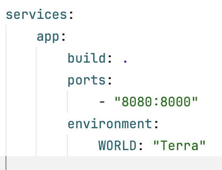

author: Joao Correia
summary: Docker introduction
id: dist
tags: il,workshop,docker,python
categories: docker,python

# Hello python app in docker

## Requirements

Duration: 0:5:00

* git: [https://desktop.github.com](https://desktop.github.com)
* docker: [https://www.docker.com/products/docker-desktop/](https://www.docker.com/products/docker-desktop/)

**Clone Repository:**

1. open a shell (for example: powershell)
2. execute `git clone https://github.com/casta-114/il-docker-workshop.git`
3. execute `cd il-docker-workshop`

## Run App

Duration: 0:02:00

1. execute `docker-compose up --build`
2. open [http://localhost:8080](http://localhost:8080)
3. play

## Modify docker-compose

Duration: 0:05:00

Here we will add an environment variable in our app, using the docker-compose file.

1. open docker-compose.yaml
2. under "app:" and the "environment" property with the key-value `WORLD: "Terra"` like the image below:

3. if application is running, close it. Usually `ctrl + z` works
4. execute `docker-compose up --build` to rebuild application
5. open [http://localhost:8080](http://localhost:8080)

## Go Hero

Duration: 0:20:00

Together, we will do an exercise where we create 3 docker containers.

1. postgresql, a container with a database
2. brand_read, a container with an app that reads data from postgresql container
3. brand_write, a container with an app that writes data to postgresql container

All the python code for this exercise is inside folder `ex1/`

The objective here is to create the Docker file for each app, `brand_read/` and `brand_write/`,
and the docker-compose file to orchestrate both apps and the postgresql container.

In this exercise we will learn:

* how to pull and use images from [docker hub](https://hub.docker.com)
* create a network so that different containers can interact between each other
* use `depends_on` feature to create start dependencies between container

Lets look at docker postgresql docker image in [docker hub](https://hub.docker.com/r/bitnami/postgresql) and
understand how to use it and configure it.
